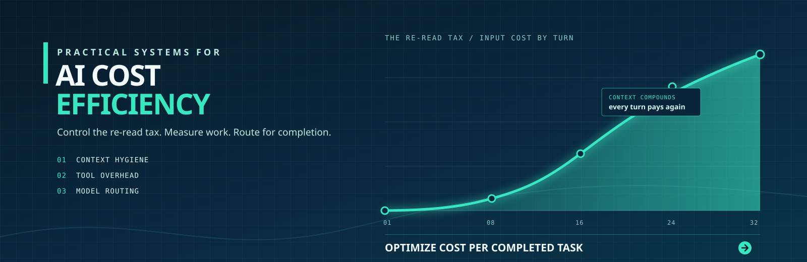

# AI Cost Efficiency

**A practical system for controlling the cost of coding agents and LLM tooling, built on the one mechanic most teams never price in: the model re-reads everything, every turn.**

This is not a "count your tokens" repo. It is a set of standards, templates, runnable tools, and measurement methods for the specific cost physics of agentic AI: conversation re-reading, tool catalog overhead, prompt caching, model routing, and the only metric that actually matters, cost per completed task.

Works with any agentic coding setup: Claude Code, Cursor, VS Code with GitHub Copilot, Codex CLI, Gemini CLI, aider, or your own harness. Vendor-neutral by design. Nothing here quotes a price, because prices go stale; everything here explains mechanics, which do not.

---

## The core mechanic, stated once

A large language model has no memory between API calls. It is a stateless function. What feels like a "conversation" is an illusion maintained by the client: on every turn, the client resends the **entire** history (system prompt, instruction files, tool catalog, every prior message, every prior tool result) and the model re-reads all of it before producing one new response.

Three consequences follow, and this whole repo is built on them:

1. **Session cost grows roughly quadratically with turn count.** Each turn pays for all previous turns again. Turn 30 of a session can cost more than the first ten turns combined. The expensive unit is not the question, it is the accumulated context the question rides on. (Model it yourself: `scripts/session-cost.py`.)

2. **Standing overhead is billed before any work happens.** Your system prompt, instruction files (`AGENTS.md`, `CLAUDE.md`, rules files), and every registered tool definition are resent on every single turn. A single tool definition typically costs on the order of 100 to 500 tokens (order-of-magnitude estimate; measure your own with `scripts/tool-overhead.py`). A workspace with several MCP servers attached can carry tens of thousands of tokens of standing overhead per turn, paid whether or not any tool is called.

3. **Prompt caching turns context ordering into a cost decision.** Providers discount input tokens that exactly repeat a previous request's prefix. Stable content first (system prompt, tools, instructions), volatile content last (messages). Anything that mutates the prefix mid-session, like registering a tool or editing an instruction file, invalidates the cache from that point on.

And one corollary that surprises people: **"use the cheaper model" is frequently the expensive choice.** A smaller model that needs six attempts, with a growing context and human retries, can cost more than a frontier model that finishes in one pass. The correct rule is: *the lowest-cost model that reliably completes the task class in a single pass, determined empirically.* See `routing/model-routing.md`.

## Quickstart (under five minutes)

Requires only Python 3.8+ (standard library, zero dependencies) and a shell.

```sh
git clone https://github.com/jasonjeske/ai-cost-efficiency.git && cd ai-cost-efficiency

# 1. What would an agent pay to read your project's instruction files and docs?
python3 scripts/context-size.py /path/to/your/repo

# 2. What is your standing tool overhead per turn?
#    Point it at any MCP/tool config (mcp.json, .mcp.json, a tools dump).
python3 scripts/tool-overhead.py /path/to/your/mcp.json

# 3. See the re-read mechanic with your own numbers.
python3 scripts/session-cost.py --turns 30
python3 scripts/session-cost.py --turns 30 --split 3   # same work, 3 fresh sessions

# 4. Find oversized instruction files across a repo.
python3 scripts/instruction-audit.py /path/to/your/repo
```

Every script supports `--help` and `--json`, produces bounded output by default, and exits nonzero on error.

**Using this in Cursor or VS Code with GitHub Copilot?** See `docs/editor-setup.md` for the exact filenames each editor reads, cited to vendor documentation, plus a five minute walkthrough that produces real numbers.

Then adopt in this order:

1. Read `standards/context-hygiene.md` (one page, the daily practices).
2. Drop `templates/AGENTS.md` into a project and cut it down to what earns its per-turn cost.
3. Audit your tool servers against `standards/tool-design.md` and the checklist in `templates/workspace-config/`.
4. When you want numbers instead of vibes, run the method in `measurement/`.

## Repo map

| Path | What it is |
|---|---|
| `standards/context-hygiene.md` | The individual practices, deliberately one page. Start here. |
| `standards/tool-design.md` | The output contract every agent-facing tool must meet. |
| `templates/AGENTS.md` | Annotated instruction-file template. Explains why each section earns its re-read-every-turn cost. |
| `templates/workspace-config/` | Baseline editor settings, ignore files, and an audited tool-server process for Cursor and VS Code. |
| `scripts/` | Four runnable, dependency-free CLI tools (see Quickstart). |
| `skills/` | Packaged procedures loaded on demand instead of living in always-loaded instructions. |
| `routing/model-routing.md` | Task class to model tier, maintained as an empirical table with an evidence column. |
| `measurement/` | How to baseline consumption and compute cost per completed task, with a worked example. |
| `docs/editor-setup.md` | Exact instruction and config filenames for Cursor and VS Code with Copilot, with vendor citations. |
| `docs/billing-mechanics.md` | The deeper explanation of re-reading, caching, and tool overhead. |

## Who this is for

**An individual developer** gets value from the top half alone: the one-page hygiene standard, the instruction-file template, and the scripts. No process, no buy-in required, effective in the first session.

**An organization** adopts the whole thing: standards as review criteria, the workspace config as a baseline image, the tool-design contract as a merge gate for internal MCP servers, the routing table as shared empirical policy, and the measurement method as the basis for honest reporting. The structure is deliberately layered so the org rollout is the individual practice plus governance, not a different practice.

## The metric that keeps this honest

Optimize **cost per completed task**, never tokens consumed.

Token-minimization as a goal creates a perverse incentive: the cheapest session is the one that never happens, so teams "save money" by using AI less rather than better. That is a productivity cut wearing a cost-control costume. Cost per completed task points the same instinct at the real target: complete the same work, or more of it, for less. A change that halves token spend but breaks task completion is a regression. The full method, including how to define "completed," is in `measurement/`.

## Limitations, honestly

- **Token counts here are estimates.** The scripts use a characters-per-token heuristic (default 4.0, tunable) because exact tokenization is vendor- and model-specific. Estimates are typically within tens of percent, which is enough for ranking and budgeting decisions, not for invoice reconciliation. Use your provider's usage dashboard or token-counting API for exact numbers.
- **No prices are quoted, ever.** Billing mechanics are stable; prices, cache discounts, and cache lifetime windows change frequently. The tools accept your current rates as arguments and point you to vendor pricing pages.
- **Client behavior varies.** Agent harnesses differ in how they compact history, cache prefixes, and inject tool schemas, and those behaviors change between releases. Verify against your tool's documentation; treat this repo's models as the default mental model, not a spec of any one product.
- **The routing table ships empty of universal truth.** Model-to-task fit is empirical and decays as models ship. The table's format forces an evidence column and a review date precisely because any static answer would be wrong within months.
- **Caching is provider-dependent.** Some platforms cache implicitly, some require explicit cache markers, some do not cache at all. The ordering discipline is worth following everywhere because it costs nothing and pays wherever caching exists.

## Prior art

The billing mechanics described here are vendor-documented behavior, not discoveries. The tool-design standard in `standards/tool-design.md` restates guidance that circulates publicly under the heading of agent tool interface design, sometimes called AXI, and I make no claim of originality over those principles. What this repo adds is the cost framing, the runnable measurement scripts, and the task-completion metric that ties them together. Where a rule here matches something you have read elsewhere, assume convergence on the same mechanics rather than independent invention.

## Contributing

See `CONTRIBUTING.md`. Evidence-backed corrections to the mechanics docs and new task-class rows for the routing table (with the experiment attached) are the most valuable contributions.

## License

MIT. See `LICENSE`.
